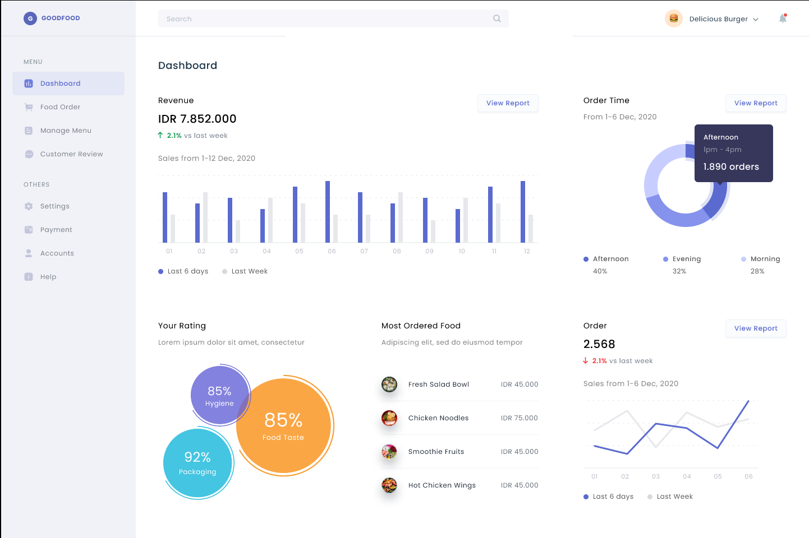
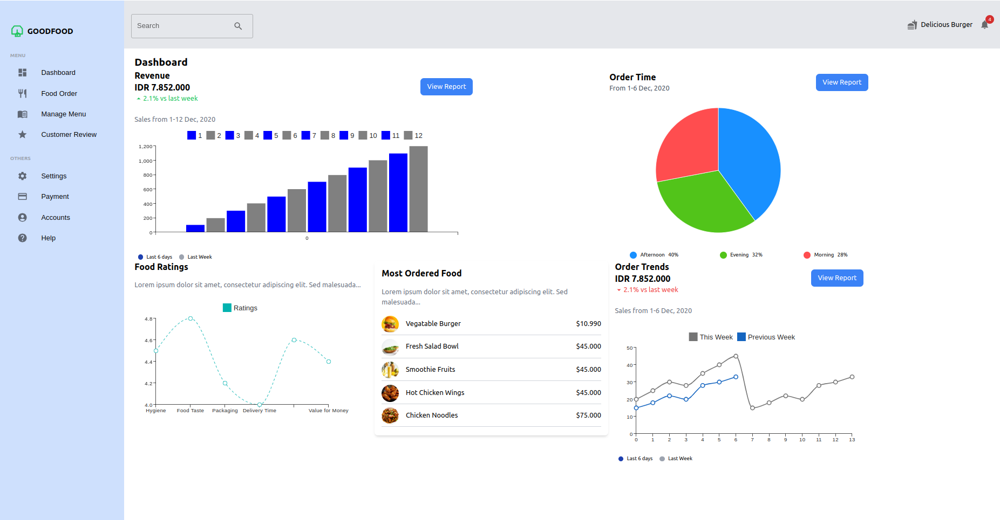

# React Typescript Dashboard

[Good Food Dashboard](https://www.figma.com/proto/L8NQuywp3MA2YUKrGXsmR4/Dashboard-(Community)?node-id=0-61)



### Overview

This Dashboard is a web application built using React+Vite and TypeScript. It serves as a management tool for a food delivery service called "GoodFood". The dashboard provides various features and visualizations to monitor and manage different aspects of the service, such as revenue, order trends, customer reviews, and most ordered food items.

However, it is not fully functional[dynamic] as such since it is an attempt to interpret a mockup figma [template](https://www.figma.com/proto/L8NQuywp3MA2YUKrGXsmR4/Dashboard-(Community)?node-id=0-61) and represent it in the frontend. It is not an exact copy of the template, but in all respects it answers to most of the features that define the template. It is also **NOT RESPONSIVE** especially on mobile devices.

### Project Structure

This is a basic hierarchy structure that captures the project's key features and makes it effortless to navigate through its components.

```bash
goodfood-dashboard/
│
│
├── public/                     # Public folder
│
│
├── src/
│   ├── components/             # React components
│   │   ├── header/
│   │   │   └── Header.tsx
│   │   ├── mostordereditems/
│   │   │   └── MostOrderedItems.tsx  
│   │   ├── ordertimechart/
│   │   │   └── OrderTimeChart.tsx
│   │   ├── ordertrendchart/
│   │   │   └── OrderTrendChart.tsx
│   │   ├── ratingchart/
│   │   │   └── RatingChart.tsx
│   │   ├── revenuechart/
│   │   │   └── RevenueChart.tsx
│   │   ├── sidebar/
│   │   │   └── Sidebar.tsx
│   │   └── topbar/
│   │       └── Topbar.tsx
│   │
│   ├── data.ts           # static data file
│   │
│   ├── pages/
│   │   └── Dashboard.tsx        #Dashboard page
│   │
│   │
│   ├── App.tsx                 # Main application component
│   └── main.tsx               # Entry point
│
│
├── index.html              # HTML template
│
│
├── tailwind.config.js       # Tailwind CSS configuration file
├── postcss.config.js        # Tailwind CSS autoprefixer configuration file
│
│  
└── README.md                   # Project documentation

```

## Components

The Dashboard's main components are:

- **Sidebar Navigation:** Contains navigation links for different sections of the dashboard.
- **Revenue Chart:** The Bar chart that displays revenue data for the last 6 days and the previous week.
- **Order Time Pie Chart:** The Pie chart that visualizes the order of distribution across different time periods in a day.
- **Rating Chart:** The Rating Line chart displays ratings for different aspects of the service.
- **Most Ordered Food Items:** List's most ordered food items with names and prices.
- **Order Line Chart:** This Line chart shows the order trend for the last 6 days and the previous week.

## Usage

To run the application locally:

1. Clone the repository:

   ```bash
   git clone git@github.com:preston-56/git@github.com:preston-56/goodfood-dashboard.git
   ```

   OR

   ```bash
   git clone https://github.com/preston-56/git@github.com:preston-56/goodfood-dashboard.git
   ```
2. Navigate to the project directory:

   ```bash
      cd goodfood-dashboard
   ```
3. Install dependencies:

   ```bash
   npm install
   ```
4. Start the development server:

   ```bash
   npm run dev
   ```
5. Open the application in your web browser:

   ```bash
   http://localhost:3000
   ```

Here's the dashboard's [LIVE LINK](https://ts-dash.netlify.app/)

🚧 **Work in Progress**



## Technologies Used

- [React](https://reactjs.org/): A JavaScript library for building user interfaces.
- [TypeScript](https://www.typescriptlang.org/): A typed superset of JavaScript for enhanced code quality and developer productivity.
- [Material-UI Charts](https://mui.com/): Open-source charting library for creating interactive charts and visualizations.
- [Tailwind CSS](https://tailwindcss.com/): A utility-first CSS framework for quickly building custom designs.
- [Vite](https://vitejs.dev/): A fast build tool for modern web development.

## Dependencies

The project utilizes the following dependencies:

- React: A JavaScript library for building user interfaces.
- TypeScript: A statically typed superset of JavaScript.
- Tailwind CSS: A utility-first CSS framework.
- Material-UI: A popular React UI framework for building responsive web applications.
- Vite: A fast build tool for modern web development.

## Future Improvements

- Feature(s) responsiveness.
- Implement real-time data fetching and updates using APIs.
- Enhance user authentication and authorization features.
- Add additional visualizations and analytics for deeper insights into the service metrics.

## Contributing

Contributions to this Dashboard project are welcome. If you find any bugs, issues, or have suggestions for improvements, please feel free to submit a pull request or open an issue on the GitHub repository.

## License

This project is licensed under the MIT License. See the [LICENSE](./LICENSE) file for more information.
